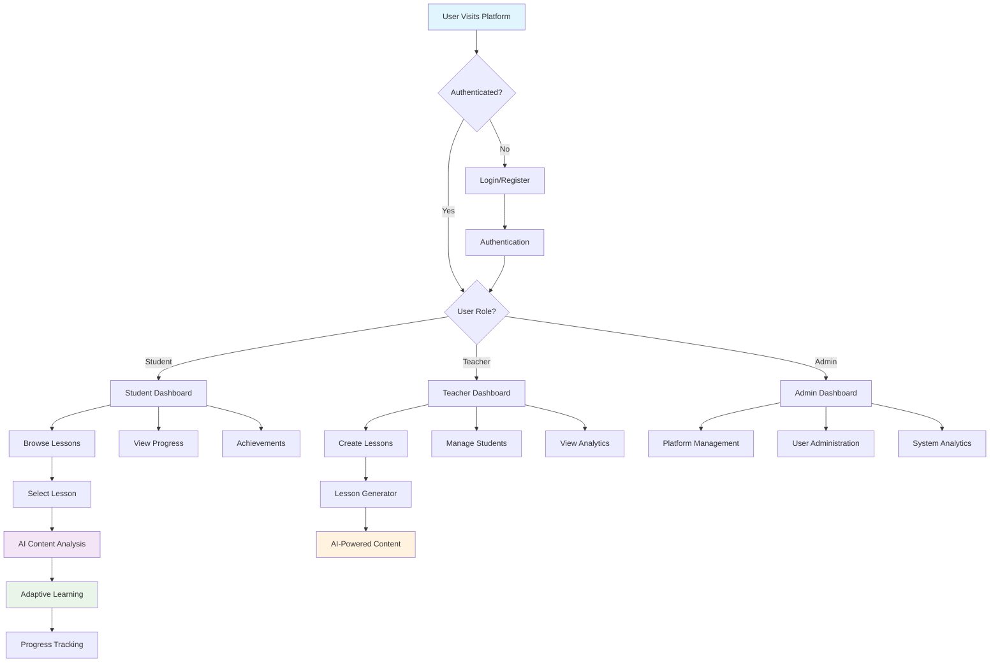

# Assistive Learning Tools Platform

A comprehensive, accessible learning platform designed to support students with diverse learning needs through AI-powered tools and adaptive interfaces.

## Features

### 🎯 Core Learning Tools
- **AI-Powered Content Analysis** - Natural language processing for text comprehension
- **Custom Language Support** - Multi-language learning capabilities
- **Interactive Lessons** - Engaging, adaptive lesson content
- **Progress Tracking** - Detailed analytics and achievement system

### ♿ Accessibility Features
- **High Contrast Mode** - Enhanced visual accessibility
- **Dyslexic-Friendly Fonts** - Specialized typography support
- **Reading Ruler** - Visual reading assistance
- **Adjustable Font Sizes** - Customizable text scaling
- **Reduced Motion** - Motion-sensitive user support
- **Screen Reader Compatible** - Full ARIA compliance

### 👥 Multi-Role Support
- **Students** - Access lessons, track progress, earn achievements
- **Teachers** - Create and manage lessons, monitor student progress
- **Administrators** - Platform management and analytics

## Tech Stack

- **Frontend**: React 18 + TypeScript + Vite
- **Styling**: Tailwind CSS
- **State Management**: Zustand
- **Routing**: React Router v6
- **Forms**: React Hook Form + Yup validation
- **Animations**: Framer Motion
- **Icons**: Lucide React
- **Testing**: Vitest + Playwright + Testing Library
- **Backend**: Supabase (optional)
- **AI Integration**: Google Gemini API

## Quick Start

### Prerequisites
- Node.js 18+
- npm or yarn

### Installation

1. **Clone the repository**
   ```bash
   git clone <repository-url>
   cd HACKS
   ```

2. **Install dependencies**
   ```bash
   npm install
   ```

3. **Set up environment variables**
   ```bash
   cp .env.example .env
   ```
   Edit `.env` and add your API keys:
   ```env
   VITE_GEMINI_API_KEY=your_gemini_key_here
   VITE_SUPABASE_URL=your_supabase_url
   VITE_SUPABASE_ANON_KEY=your_supabase_key
   ```

4. **Start development server**
   ```bash
   npm run dev
   ```

5. **Open browser**
   Navigate to `http://localhost:5173`

## Available Scripts

- `npm run dev` - Start development server
- `npm run build` - Build for production
- `npm run preview` - Preview production build
- `npm run test` - Run unit tests
- `npm run test:e2e` - Run end-to-end tests
- `npm run lint` - Run ESLint
- `npm run format` - Format code with Prettier

## Application Flow



## Project Structure

```
src/
├── components/          # Reusable UI components
│   ├── accessibility/   # Accessibility-specific components
│   ├── auth/           # Authentication components
│   ├── layout/         # Layout components
│   ├── learning/       # Learning-specific components
│   └── ui/             # Generic UI components
├── lib/                # Utility libraries and services
│   ├── adapters/       # AI service adapters
│   └── *.ts           # Core services
├── pages/              # Page components
│   ├── admin/         # Admin pages
│   ├── auth/          # Authentication pages
│   ├── student/       # Student pages
│   └── teacher/       # Teacher pages
├── stores/            # Zustand state stores
├── types/             # TypeScript type definitions
└── test/              # Test utilities
```

## Configuration

### Environment Variables
See `.env.example` for all available configuration options including:
- AI API keys (Gemini, OpenAI, Anthropic)
- Database configuration (Supabase)
- Analytics and monitoring
- Feature flags

### Accessibility Settings
The platform automatically saves user accessibility preferences including:
- Theme (light/dark)
- High contrast mode
- Font preferences
- Text spacing
- Motion preferences

## API Integration

### AI Adapters
The platform supports multiple AI providers through a unified adapter pattern:
- **Gemini** (primary)
- **OpenAI** (fallback)
- **Local processing** (offline mode)

### Lesson Generation
Python script (`lesson_generator.py`) for automated lesson content creation.

## Testing

- **Unit Tests**: Vitest with React Testing Library
- **E2E Tests**: Playwright
- **Accessibility Tests**: Axe-core integration
- **Coverage**: Built-in coverage reporting

Run tests:
```bash
npm run test              # Unit tests
npm run test:e2e         # End-to-end tests
npm run test:coverage    # Coverage report
```

## Deployment

1. **Build the project**
   ```bash
   npm run build
   ```

2. **Deploy the `dist` folder** to your hosting provider

### Recommended Hosting
- Vercel
- Netlify
- AWS Amplify
- GitHub Pages

## Contributing

1. Fork the repository
2. Create a feature branch
3. Make your changes
4. Run tests and linting
5. Submit a pull request

## License

This project is licensed under the MIT License.

## Support

For support and questions, please open an issue in the repository.